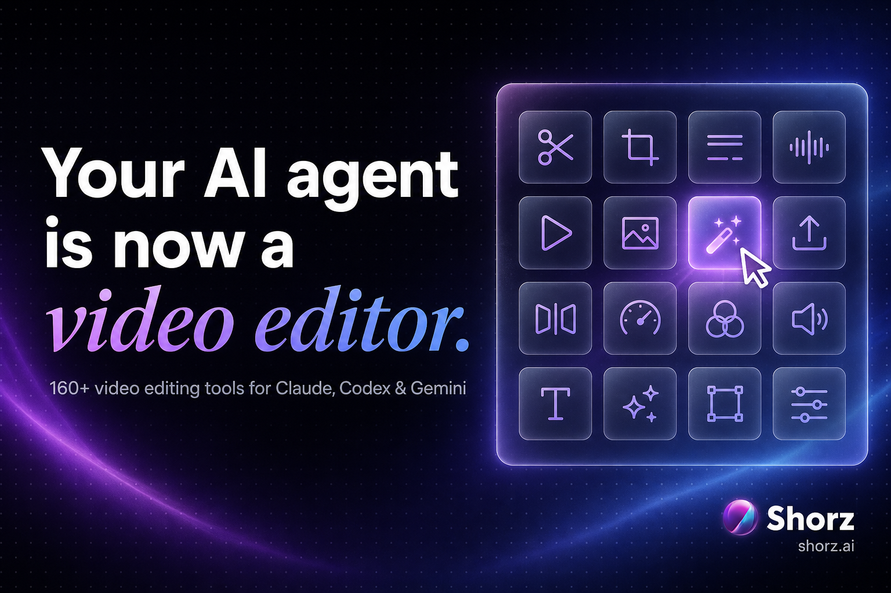

<div align="center">



# AI video agent for Claude, Codex & Gemini — 160+ video editing tools via MCP

**160+ video editing tools for your AI agent, over the Model Context Protocol.** Shorz is a free-to-download Windows desktop app that ships a full MCP server inside the installer — connect it once and your agent can auto-edit long videos, clip a podcast into shorts, add subtitles, generate avatars and thumbnails, and schedule the result to YouTube, TikTok, Instagram, Facebook, X, LinkedIn, Threads and Pinterest.


**[Get Shorz — free →](https://www.shorz.ai/)** · [Tool catalog on shorz.ai](https://shorz.ai/tools/mcp) · [What's new](https://shorz.ai/updates)

</div>

---

## What is this?

This is **Shorz MCP** — the Model Context Protocol server that ships inside the free Shorz desktop app, turning any MCP-capable agent into an AI video editing agent.

Coding agents got good. Video agents didn't — because they had no hands. Shorz gives them hands.

The [Shorz desktop app](https://shorz.ai) is an AI video editor for Windows (macOS in progress). Every install includes a **standalone MCP server** — no separate package, no API keys to wire up, no subscription. Point Claude Code, Claude Desktop, Cursor, Codex or Gemini at it and the agent gets the same controls a human editor has in the app:

- **6 project types** — Auto Edit Video, Text-to-Video, Avatar, Podcast, Advertisement, Clipping
- **Headless single-file edits** — trim, crop, resize, concat, speed, reverse, fades, audio extraction and more, straight on loose files with **no project needed** (these run locally and are free)
- **Panels** — subtitles + dubbing, B-roll, animated titles, borders, overlays, audio visualizers, thumbnails, Animation Studio motion graphics
- **Publishing** — post or schedule to **YouTube, TikTok, Instagram, Facebook, X, LinkedIn, Threads, Pinterest**
- **Live UI control** — the agent can drive the actual app window, with a visible cursor

**144 of the 160 tools are free to run.** The rest are AI generation tools that spend prepaid Shorz credits from your signed-in account (1 credit = €0.01, packs from €19.90, credits never expire, no subscription) — and every tool's cost is labeled in the catalog below, so your agent can check the price before spending anything. One tool (`validate_elevenlabs_api_key`) uses your own ElevenLabs key, and only if you want your own cloned voice.

> *Vibe create videos at the speed of ideas.*

---

## Quickstart (60 seconds)

1. **[Get Shorz](https://www.shorz.ai/)** — free download, no card — install and sign in.
2. Open **Connect AI Agent** in the app header. Pick your client — Shorz writes the MCP config for you with one click (Cursor, Claude Desktop, Claude Code, Codex, Antigravity) and can install the agent skills too.
3. Restart your agent and ask it for something:

> *"Take podcast.mp4, make a 9:16 project, turn subtitles on, and render it."*

Shorz must be running — the app hosts the bridge the MCP server talks to.

### Manual setup

The server ships at `%LOCALAPPDATA%\Programs\Shorz\resources\mcp-server\index.js` (Node.js required). The app's Connect AI Agent modal prints your exact path and copies it to the clipboard.

**Claude Code** (registers user-scoped, available in every project):

```bash
claude mcp add --transport stdio --scope user shorz -- node "C:\Users\you\AppData\Local\Programs\Shorz\resources\mcp-server\index.js"
```

**Claude Desktop / Cursor / Antigravity** (`claude_desktop_config.json`, `~/.cursor/mcp.json`, or `~/.gemini/antigravity/mcp_config.json`):

```json
{
  "mcpServers": {
    "shorz": {
      "command": "node",
      "args": ["C:\\Users\\you\\AppData\\Local\\Programs\\Shorz\\resources\\mcp-server\\index.js"]
    }
  }
}
```

**Codex** (`~/.codex/config.toml`, timeouts raised so long renders don't get cut):

```toml
[mcp_servers.shorz]
command = "node"
args = ["C:\\Users\\you\\AppData\\Local\\Programs\\Shorz\\resources\\mcp-server\\index.js"]
enabled = true
startup_timeout_sec = 30
tool_timeout_sec = 120
```

**Gemini CLI:**

```bash
gemini mcp add shorz -- node "C:\Users\you\AppData\Local\Programs\Shorz\resources\mcp-server\index.js"
```

---

## What can the agent actually do?

Real prompts that map onto real tool chains — every one of these works with the tools below:

| Prompt | What happens |
|---|---|
| *"Make a 9:16 project from podcast.mp4, turn subtitles on, add AI B-roll, and render it."* | Podcast → vertical short with subtitles and B-roll |
| *"Trim ad.mp4 to 0:12–0:41, crop it to 9:16, fade the audio out at the end, and save it to my Desktop."* | Headless file edit — no project, runs locally, free |
| *"Check my Shorz balance first, then generate four thumbnail options for the title 'I quit my job'."* | Agent checks cost before spending a credit |
| *"Build a Text-to-Video project from script.md, use this photo as the character reference so she looks the same in every scene, then render it."* | Consistent-character video from a script |
| *"Tell me what it costs to publish today's render to TikTok, Instagram and YouTube — then schedule all three for 6pm."* | Priced, then scheduled to three platforms |
| *"Find five Pexels drone clips of a coastline, download them, and import them into my project's B-roll lane."* | Stock sourcing → B-roll, end to end |
| *"What's getting traction on X about AI video this week? Take the strongest angle, write a 30-second script, and set it as my brief."* | Research → script → project brief |
| *"Make an avatar video from headshot.jpg reading this script, add two more angles of the same avatar, and put subtitles on it."* | Talking-head video from one photo |

<div align="center">

</div>

---

## The free tier (real limits, no watermark — ever)

The app download is free. On top of that, signed-in users get a real free tier: **Auto Edit and Clipping, 4 free videos a week** (resets Monday, no card, source videos up to 30 minutes). Everything that spends credits stays locked on the free tier — and Text-to-Video, Avatar, Podcast and Advertisement are paid features.

What Shorz **never** does, on any tier: watermark your output. There is no watermark to remove, at any price, on anything.

<div align="center">

</div>

---

## Agent skills included (this repo ships them)

MCP exposes the tools; **agent skills teach your agent how to use them well** — the workflows, the panel order, the cost checks, the gotchas. The [`agent-skills/shorz-mcp`](agent-skills/shorz-mcp) folder in this repo is the same skill bundle every Shorz install ships:

- `SKILL.md` — the operating manual for driving Shorz over MCP
- `references/project-workflows/` — end-to-end recipes per project type
- `references/panel-workflows/` — every panel (subtitles, B-roll, titles, borders, overlays, audio, thumbnails…)
- `references/headless-workflows/` — loose-file editing, stock media, X research, free image generation
- `references/guided-creation/` — interview-style flows that turn a vague idea into a finished spec

Install from the app (**Connect AI Agent → Install skills now**) or copy the folder into your client's skill directory (`~/.claude/skills/`, `~/.cursor/skills/`, `~/.agents/skills/`, or `~/.gemini/` for Antigravity).

Claude user? There's a dedicated install guide at [Vossy/claude-video-editing-skill](https://github.com/Vossy/claude-video-editing-skill).

---

## The full tool catalog — 160 tools in 16 categories

Cost column: **Free** = runs locally or against the app bridge at no cost · *Shorz credits* = AI generation billed from your prepaid balance (the agent can price it first) · *Your own key* = optional ElevenLabs key for voice cloning.

| Category | Tools | Free to run |
|---|---|---|
| [Account & credits](#account--credits) | 7 | 7/7 |
| [Projects & settings](#projects--settings) | 9 | 9/9 |
| [Brief & main AI model](#brief--main-ai-model) | 3 | 3/3 |
| [Create Video & rendering](#create-video--rendering) | 7 | 5/7 |
| [Panel settings](#panel-settings) | 12 | 12/12 |
| [Avatar, podcast & reference inputs](#avatar-podcast--reference-inputs) | 16 | 16/16 |
| [Media generation](#media-generation) | 8 | 1/8 |
| [Headless single-file edits](#headless-single-file-edits) | 22 | 21/22 |
| [Assets & library](#assets--library) | 21 | 21/21 |
| [Downloads](#downloads) | 7 | 7/7 |
| [Thumbnail Creator](#thumbnail-creator) | 5 | 4/5 |
| [Animation Studio](#animation-studio) | 9 | 6/9 |
| [Publishing & social](#publishing--social) | 18 | 17/18 |
| [Research & stock media](#research--stock-media) | 7 | 6/7 |
| [Live UI control](#live-ui-control) | 6 | 6/6 |
| [Jobs & app state](#jobs--app-state) | 3 | 3/3 |

### Account & credits

Sign the user in, read the balance, and check what a model costs before spending anything.

| Tool | What it does | Cost |
|---|---|---|
| `get_shorz_credits` | Reads the signed-in account's Shorz credit balance and entitlements — the check an agent should run before any paid generation. | **Free** |
| `get_shorz_usage_and_pricing` | Returns the same numbers as the in-app Usage & Pricing window: what each model costs in credits, plus recent spend. | **Free** |
| `shorz_sign_in_send_code` | Step one of sign-in: emails the user a one-time Shorz login code, exactly like the in-app Sign in button. | **Free** |
| `shorz_sign_in_verify_code` | Step two of sign-in: verifies the emailed code and signs the desktop app in. The header balance updates live. | **Free** |
| `read_api_keys` | Reads the credentials the app holds — an optional bring-your-own ElevenLabs key, plus this machine's hardware id. | **Free** |
| `validate_elevenlabs_api_key` | Checks that a bring-your-own ElevenLabs API key actually works before the app starts using it. | **Free** |
| `get_elevenlabs_balance` | Reads the character balance left on the user's own ElevenLabs account (only relevant with a BYO key). | **Free** |

### Projects & settings

Create projects, read and patch settings.json, and switch the output frame — the spine every workflow runs on.

| Tool | What it does | Cost |
|---|---|---|
| `create_project` | Creates a new Shorz project folder, ready for panels, assets and a render. | **Free** |
| `list_projects` | Lists every project on disk with its path — how an agent finds the one to work in. | **Free** |
| `get_current_open_project` | Reports which project the user currently has open on screen, so the agent edits what they are looking at. | **Free** |
| `read_project_settings` | Reads a project's whole settings.json — every panel value the render will use. | **Free** |
| `update_project_settings` | Patches settings.json with a targeted deep merge instead of rewriting it, so nothing the agent didn't mention gets lost. | **Free** |
| `delete_project` | Deletes a project. | **Free** |
| `switch_project_aspect_ratio` | Switches the project between 16:9, 1:1 and 9:16 (and optionally its fps) by rewriting the output dimensions. | **Free** |
| `get_projects_path` | Returns the base folder Shorz keeps projects in. | **Free** |
| `get_resource_path` | Returns the app's resource folder — used to locate bundled files such as the connector itself. | **Free** |

### Brief & main AI model

Set the creative brief the way a human types it into the PromptBar, and pick the model that reads it.

| Tool | What it does | Cost |
|---|---|---|
| `set_user_instructions` | Writes the PromptBar brief — what the video should be — without starting a render. | **Free** |
| `list_main_ai_models` | Lists the main AI models available right now, straight from the live server catalog rather than a hardcoded list. | **Free** |
| `set_main_ai_model` | Picks the main AI model that plans the edit — Claude, GPT or Gemini, whichever the catalog currently offers. | **Free** |

### Create Video & rendering

Start the same render the Create Video button starts, then watch it through to done.

| Tool | What it does | Cost |
|---|---|---|
| `trigger_create_video` | Presses Create Video. Uses the saved brief, or a one-off override that doesn't overwrite what the user typed. | Shorz credits |
| `generate_video` | Starts a render from a brief passed in the call and returns immediately — poll for status rather than blocking. | Shorz credits |
| `get_video_generation_status` | Polls the current and most recent render: still working, finished, or failed. | **Free** |
| `stop_video_generation` | Stops a render that is in progress. | **Free** |
| `render_text_preview` | Renders a title or subtitle to a PNG so the agent can actually see the type before committing it to a video. | **Free** |
| `compile_remotion_preview` | Compiles the Remotion source behind the editor preview. | **Free** |
| `remotion_render` | Renders a Remotion composition to MP4 as a background job — bundling plus rendering can take minutes. | **Free** |

### Panel settings

One tool per sidebar panel. Everything a human can toggle in Shorz, an agent can set — with the same validation.

| Tool | What it does | Cost |
|---|---|---|
| `set_general_video_settings` | The Settings panel: Auto Zoom (count, strength, speed and the zoom-in/zoom-out effect pools), face tracking, freeze-frame, grayscale, colour and speed. | **Free** |
| `set_subtitle_settings` | Subtitle styling: font, colours, background, stroke, position and animation. | **Free** |
| `set_title_settings` | The title card: text (emoji allowed), style, placement, background box, strokes and animation. | **Free** |
| `set_broll_settings` | The B-roll panel: your imported clips, web images, GIFs, AI-generated B-roll (stills or video) and emoji — plus where each sits in frame. | **Free** |
| `set_audio_settings` | The Audio panel: dubbing, music and sound-effect toggles, reverb, volumes and music fades. | **Free** |
| `set_audio_visualization_settings` | The audio-reactive overlay — spectrum bars, waveform, circular bars, voice blob and six more styles, each with its own colour. | **Free** |
| `set_overlay_settings` | The Overlay panel: turns overlay effects on and picks them by name, validated against what's actually installed. | **Free** |
| `set_border_settings` | The Border panel: on/off, width, two colours and an animated border style. | **Free** |
| `set_text_to_video_settings` | The Text-to-Video panel: source mode, script or audio, transitions, image motion, model and reference images. | **Free** |
| `set_avatar_settings` | The Avatar panel: model, script or audio, voice, avatar image, motion instructions and up to three extra angle shots of the same avatar. | **Free** |
| `set_podcast_settings` | The Podcast panel: script, both voices, both avatars, display style and camera motion. | **Free** |
| `set_advertisement_settings` | The Advertisement panel: product and character images, and the total ad length in 10-second storyboard scenes (10–60s). | **Free** |

### Avatar, podcast & reference inputs

The files those panels point at — avatar photos, extra angles, product shots, voice recordings and character references.

| Tool | What it does | Cost |
|---|---|---|
| `select_avatar_image` | Points the Avatar panel at a local photo — the person who will be lip-synced. | **Free** |
| `select_avatar_angle_image` | Adds another shot of the same avatar from a different angle (max 3), so the presenter isn't locked to one pose. | **Free** |
| `save_avatar_image` | Saves an avatar image into the project. | **Free** |
| `select_avatar_audio` | Points the Avatar panel at an existing local audio file instead of a typed script. | **Free** |
| `save_avatar_audio` | Saves an audio file as the avatar's voice track. | **Free** |
| `delete_avatar_audio` | Removes the avatar's saved audio track. | **Free** |
| `select_podcast_avatar_image` | Sets the interviewer's or interviewee's face for a podcast project. | **Free** |
| `select_advertisement_image` | Sets the ad's product shot or character reference from a local image. | **Free** |
| `remove_advertisement_image` | Clears the ad's product or character image. | **Free** |
| `save_text_to_video_typed_reference` | Adds a typed reference image so a scene keeps its look: a character (same person every scene), an environment (same location), or a global style. | **Free** |
| `update_text_to_video_typed_reference` | Renames a typed reference or updates the notes attached to it. | **Free** |
| `delete_text_to_video_typed_reference` | Removes a typed character, environment or style reference and its cached character sheet. | **Free** |
| `save_text_to_video_reference_images` | Saves reference images to the older flat style list (typed references are preferred). | **Free** |
| `delete_text_to_video_reference_image` | Removes an image from that older flat style list. | **Free** |
| `save_text_to_video_speech_audio` | Saves a narration audio file for a Text-to-Video project, instead of generating the voice. | **Free** |
| `delete_text_to_video_speech_audio` | Removes that saved narration audio. | **Free** |

### Media generation

Make the footage, stills and voice you don't have — no project needed, straight to a file path.

| Tool | What it does | Cost |
|---|---|---|
| `generate_images` | Generates images with model, aspect, quality and variation control — and optional face references so the same person comes back every time. | Shorz credits |
| `generate_images_nano_banana_free` | Generates images with Google's Nano Banana 2 on the user's own Google AI Studio key: no Shorz credits at all, just that key's free quota. MCP-only — these models aren't in the app's pickers. | Your own key |
| `generate_scene_image` | Generates a single scene still through the same stack Text-to-Video exports use — the one to pick when reference-image editing matters. | Shorz credits |
| `generate_image_to_video` | Turns a local still into a short video clip via Veo, Seedance, Kling and friends. Minutes, not seconds. | Shorz credits |
| `proxy_aiml_video_generation` | Direct text-to-video and image-to-video generation through the credit proxy, for agents that want to name the model and poll it themselves. | Shorz credits |
| `generate_tts_preview` | Speaks a line out loud as a real audio file, so a voice can be auditioned before a whole script is narrated. | Shorz credits |
| `list_elevenlabs_voices` | Lists the ElevenLabs voices available to the account, including cloned ones on a BYO key. | **Free** |
| `transcribe_video_file` | Transcribes a local video or audio file to text as a background job — long footage takes minutes. | Shorz credits |

### Headless single-file edits

Twenty-two edits that run on a file path with no project, no panels and no credits. Chain them by feeding each output into the next input.

| Tool | What it does | Cost |
|---|---|---|
| `get_media_info` | Probes a file for duration, dimensions, fps, audio track and size — the first call before any careful edit. | **Free** |
| `trim_video` | Cuts a video down to a start and end time. | **Free** |
| `crop_media` | Crops a video or image to a rectangle in pixels. | **Free** |
| `resize_media` | Resizes a video or image, keeping the aspect ratio when only one dimension is given. | **Free** |
| `fit_to_aspect` | Fits media inside a target frame and pads it with letterbox or pillarbox bars to exact dimensions. | **Free** |
| `rotate_media` | Rotates a video or image 90, 180 or 270 degrees. | **Free** |
| `flip_media` | Flips a video or image horizontally, vertically or both. | **Free** |
| `change_video_speed` | Speeds a video up or slows it down — 0.5 for half, 2.0 for double. | **Free** |
| `reverse_video` | Plays a video backwards. | **Free** |
| `loop_video` | Loops a clip a set number of times, or until it reaches a target duration. | **Free** |
| `freeze_frame` | Holds on one frame for a few seconds in the middle of a video. | **Free** |
| `fade_video` | Adds a fade-in at the start and a fade-out at the end. | **Free** |
| `set_image_duration` | Turns a still image into a video clip of a given length. | **Free** |
| `concat_media` | Joins two or more clips into one video, in order. | **Free** |
| `remove_audio` | Strips or mutes the audio track on a video. | **Free** |
| `set_audio_volume` | Scales a video's audio — 0 mutes, 1 keeps it, 2 doubles it. | **Free** |
| `audio_fade` | Fades the audio in at the start and out at the end. | **Free** |
| `extract_audio` | Pulls the audio track out of a video into a standalone audio file. | **Free** |
| `replace_audio` | Swaps a video's audio track for a separate audio file. | **Free** |
| `remove_silence` | Jump-cuts the dead air out of talking-head footage, keeping the speech either side. Only runs when explicitly asked for. | **Free** |
| `edit_image_with_ai` | Makes one small, localised AI edit to an image — a colour or lighting change, an arrow, a highlight — and returns a new file. The original is never touched. | Shorz credits |
| `extract_video_frames` | Saves stills from a video as image files so the agent can actually look at the footage — evenly spaced, or at exact timestamps. | **Free** |

### Assets & library

Read My Assets, import files into a project lane, rename, delete, and put finished files where you want them.

| Tool | What it does | Cost |
|---|---|---|
| `query_my_assets` | Searches My Assets across every tab at once — filter by category, name, date range and count. | **Free** |
| `get_my_videos` | Lists the finished videos in the library. | **Free** |
| `get_video_assets` | Lists the video files available to a project. | **Free** |
| `get_image_assets` | Lists the image files available to a project. | **Free** |
| `get_audio_assets` | Lists the audio files — music, sound effects and voice tracks. | **Free** |
| `get_downloaded_images` | Lists images downloaded from the web inside the app. | **Free** |
| `get_downloaded_gifs` | Lists the GIFs downloaded into the library. | **Free** |
| `get_generated_thumbnails` | Lists every thumbnail Thumbnail Creator has produced. | **Free** |
| `get_available_fonts` | Lists the fonts installed for titles and subtitles. | **Free** |
| `import_frontend_assets` | Imports files into the open project's library lane — main video, B-roll, sound or music — and syncs the UI live. | **Free** |
| `rename_asset` | Renames an asset in the library. | **Free** |
| `delete_asset` | Deletes a local asset. | **Free** |
| `save_file_as` | Saves a file somewhere permanent, optionally to an exact path with no dialog. | **Free** |
| `save_image_data_as` | Writes image data out to a file on disk. | **Free** |
| `select_local_image_for_import` | Opens the app's native image picker and returns the path the user chose. | **Free** |
| `open_file_directory` | Reveals a file in its folder on the desktop. | **Free** |
| `get_local_file_size` | Reports a local file's size, both human-readable and in bytes. | **Free** |
| `file_exists` | Checks whether a file is actually there before something tries to use it. | **Free** |
| `get_overlay_effects` | Lists the overlay effects available to the project. | **Free** |
| `import_overlay_effects` | Imports overlay effect files, with or without the file dialog. | **Free** |
| `delete_overlay_effect` | Removes a user-imported overlay the same way the app's trash button does — file, list and project selection all stay consistent. | **Free** |

### Downloads

Pull source footage in from the platforms, and pull generated media down to disk.

| Tool | What it does | Cost |
|---|---|---|
| `download_social_video` | Downloads a video by URL from YouTube, TikTok, Facebook or Instagram — the same validation the Clipping panel uses. | **Free** |
| `get_social_video_download_status` | Polls that download until it finishes and hands back the local file path. | **Free** |
| `download_generated_video` | Saves a generated video from its CDN URL into the video library. | **Free** |
| `download_generated_image` | Saves a generated image into the image library. | **Free** |
| `download_generated_thumbnail` | Saves a generated thumbnail into the library. | **Free** |
| `download_generated_music` | Saves a generated music track into the audio library. | **Free** |
| `save_generated_sound_effect` | Saves a generated sound effect into the audio library. | **Free** |

### Thumbnail Creator

Drive the thumbnail modal end to end — set it up, generate, and poll for the PNGs.

| Tool | What it does | Cost |
|---|---|---|
| `open_thumbnail_creator` | Opens the Thumbnail Creator modal, exactly as clicking it would. | **Free** |
| `set_thumbnail_creator_settings` | Fills in the modal live — including reference images and a YouTube thumbnail to take cues from. | **Free** |
| `thumbnail_creator_generate` | Generates thumbnails with Nano Banana or GPT Image 2 and saves the PNGs under Generated Thumbnails. | Shorz credits |
| `get_thumbnail_creator_generation_status` | Lightweight poll for whether that generation has finished. | **Free** |
| `close_thumbnail_creator` | Closes the modal. | **Free** |

### Animation Studio

Chat a motion-graphics scene into existence, compile it, and render it to MP4 — all from the agent.

| Tool | What it does | Cost |
|---|---|---|
| `animation_studio_open_modal` | Opens Animation Studio, same as clicking it in the header. | **Free** |
| `animation_studio_list_models` | Lists the chat models Animation Studio can use, from the same live catalog as the PromptBar picker. | **Free** |
| `animation_studio_send_message` | Sends a prompt to Animation Studio's chat and returns the generated animation code. | Shorz credits |
| `animation_studio_send_and_compile` | One call: prompt, extract the code, and compile the preview. | Shorz credits |
| `animation_studio_send_compile_export` | The whole thing end to end — prompt (with optional image references), compile, and render an MP4 to a path you name. | Shorz credits |
| `animation_studio_close_modal` | Closes Animation Studio. | **Free** |
| `get_animation_studio_exports` | Lists what Animation Studio has exported. | **Free** |
| `remove_animation_studio_export` | Removes one export from that list. | **Free** |
| `clear_animation_studio_exports` | Clears the export list. | **Free** |

### Publishing & social

Connect accounts, price a post before it goes out, publish or schedule to eight platforms, and read the numbers back.

| Tool | What it does | Cost |
|---|---|---|
| `social_publish` | The one publish tool: post or schedule a video, an image, or text alone to YouTube, TikTok, Instagram, Facebook, X, LinkedIn, Threads and Pinterest. | Shorz credits |
| `social_connect_account` | Returns a hosted OAuth link to connect a TikTok, Instagram, Facebook, X, LinkedIn, Threads or Pinterest account. | **Free** |
| `social_list_connections` | Lists the connected accounts and their status, re-synced from the publishing provider. | **Free** |
| `social_disconnect_account` | Disconnects one account, or every account on a platform. | **Free** |
| `social_get_posting_options` | The live per-platform rules before posting — TikTok privacy options and length caps, Pinterest boards, and the format limits everywhere else. | **Free** |
| `social_estimate_publish_cost` | Server-priced credit breakdown before you commit — including the surcharge X applies to captions with a link. | **Free** |
| `get_social_publish_status` | Polls a publish job started in the background until every platform reports back. | **Free** |
| `social_list_scheduled` | The content calendar: every scheduled and published post across all eight platforms, filterable by platform and status. | **Free** |
| `social_get_post_status` | Checks one scheduled or published post by id — the way to confirm an offline-scheduled post landed. | **Free** |
| `social_reschedule_post` | Moves a scheduled post to a new time, with no new charge. | **Free** |
| `social_cancel_scheduled` | Cancels a scheduled post and refunds its credits automatically. | **Free** |
| `social_refresh_analytics` | Pulls fresh performance numbers for published posts. Free — no credit charge. | **Free** |
| `youtube_upload_video` | Uploads to YouTube with privacy and category set, and can schedule it: the video goes up private and YouTube publishes it at your time. | **Free** |
| `youtube_upload_from_local_file` | Uploads a file from disk to a named YouTube channel through the same path the in-app uploader uses, with no upload UI. | **Free** |
| `youtube_auth_start` | Starts the YouTube OAuth flow to connect a channel. | **Free** |
| `youtube_auth_status` | Reports which YouTube channels are connected. | **Free** |
| `youtube_remove_account` | Removes one connected YouTube account. | **Free** |
| `youtube_sign_out` | Signs out of every connected YouTube account. | **Free** |

### Research & stock media

Find footage and find out what's happening — without leaving the chat.

| Tool | What it does | Cost |
|---|---|---|
| `pexels_search_videos` | Searches free Pexels stock video by keyword and hands back direct media URLs. | **Free** |
| `pexels_search_photos` | Searches free Pexels stock photos by keyword. | **Free** |
| `pexels_popular_videos` | Browses the most popular Pexels videos right now. | **Free** |
| `pexels_curated_photos` | Browses Pexels' editorially curated photo feed. | **Free** |
| `pexels_get_video` | Fetches one specific Pexels video by id. | **Free** |
| `pexels_get_photo` | Fetches one specific Pexels photo by id. | **Free** |
| `x_search` | Live X/Twitter search in plain language — posts, news, people, trends and media, with handle and date filters, answered with x.com citations. | Shorz credits |

### Live UI control

When something has no API, the agent can just use the app: read the screen, then move a real mouse. Refused rather than sent blind if the target is covered or disabled.

| Tool | What it does | Cost |
|---|---|---|
| `get_ui_map` | Snapshots the live Shorz window — every interactive element with its name, role, value and screen position, plus where the user currently is. | **Free** |
| `scroll_ui_element_into_view` | Scrolls an off-screen control into view and returns its new coordinates. | **Free** |
| `ui_click` | Clicks a control with a real, visible mouse — and refuses, naming the blocker, if Shorz isn't focused or something covers the target. | **Free** |
| `ui_type` | Types into whatever has keyboard focus, chunked so controlled inputs don't drop characters. | **Free** |
| `ui_press_keys` | Presses keys and shortcuts — Escape, Tab, Enter, Ctrl+A, arrow repeats. | **Free** |
| `ui_scroll` | Scrolls the mouse wheel over a point, for browsing a long list. | **Free** |

### Jobs & app state

The plumbing: poll long jobs, check for updates, and read the app's event log when something needs debugging.

| Tool | What it does | Cost |
|---|---|---|
| `get_job_status` | Polls any background job — renders, generations, uploads, transcriptions — until it completes or fails. | **Free** |
| `check_for_update` | Checks whether a newer Shorz version is out, with the release and download links. | **Free** |
| `fetch_app_events` | The raw internal event log. For renders prefer the status tools; this is for logs and debugging. | **Free** |

---

## FAQ

**Is Shorz free?**
The download is free and 144 of the 160 MCP tools run at no cost. There's also a real free tier — Auto Edit and Clipping, 4 videos a week, no card. AI generation beyond that runs on prepaid credits (1 credit = €0.01, packs from €19.90, credits never expire). No subscription, and no watermark on anything, ever.

**Which AI agents work with it?**
Anything that speaks MCP over stdio: Claude Code, Claude Desktop, Cursor, Codex, Antigravity, Gemini CLI — the app writes the config for most of these with one click.

**Do I need API keys?**
No. The agent uses your signed-in Shorz account. The one optional key is ElevenLabs, and only if you want your *own* cloned voice.

**Can the agent publish videos for me?**
Yes — post now or schedule to YouTube, TikTok, Instagram, Facebook, X, LinkedIn, Threads and Pinterest, after you connect the accounts in the app. Publishing tools report their cost before running.

**What models power the generation tools?**
Leading models like Claude, GPT, Veo, Seedance, Kling, Nano Banana and ElevenLabs — the lineup is server-driven and current pricing is always visible to the agent via `get_shorz_usage_and_pricing`.

**Does this work on macOS or Linux?**
Windows today; macOS is in progress. The MCP server itself is plain Node.js, but it needs the running desktop app next to it.

**Where does the tool list come from?**
Straight from the server's `tools/list` — the same catalog the app documents at [shorz.ai/tools/mcp](https://shorz.ai/tools/mcp). If a tool is in this README, it's registered in the shipped app.

---

## Links

- **Shorz (what it is, and the free download):** [shorz.ai](https://www.shorz.ai/)
- **Live tool explorer:** [shorz.ai/tools/mcp](https://shorz.ai/tools/mcp)
- **Changelog:** [shorz.ai/updates](https://shorz.ai/updates)
- **Support:** info@shorz.ai · X: [@shorz_app](https://x.com/shorz_app)

---

## License

The documentation and agent-skill files in this repository are MIT-licensed (see [LICENSE](LICENSE)). The Shorz desktop application itself is proprietary — free to download at [shorz.ai](https://www.shorz.ai/).

<div align="center">

*Vibe create videos at the speed of ideas.*

**[Get Shorz — free →](https://www.shorz.ai/)**

</div>
